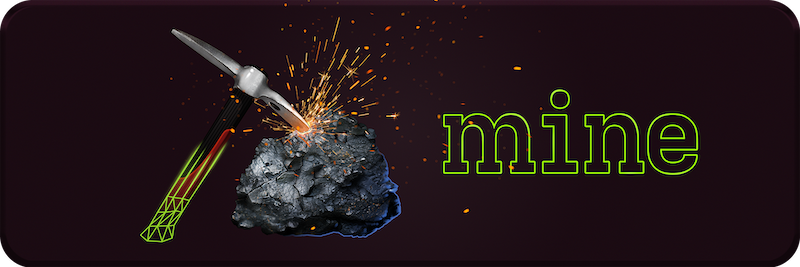
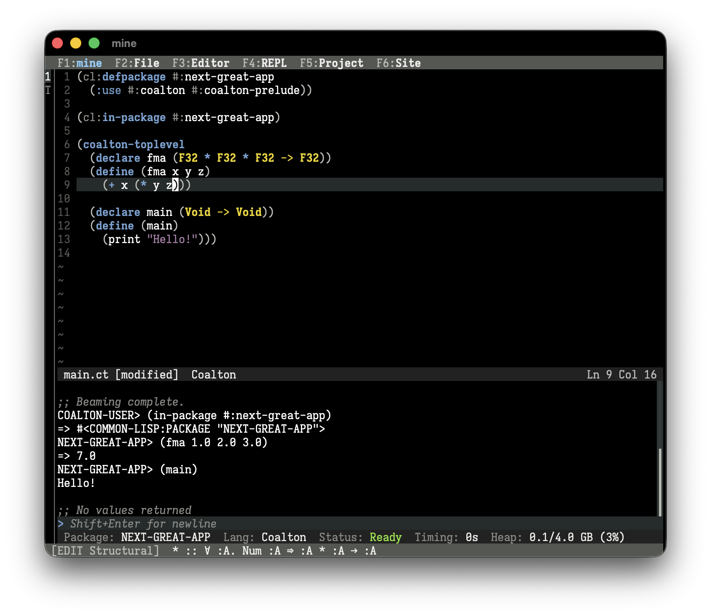
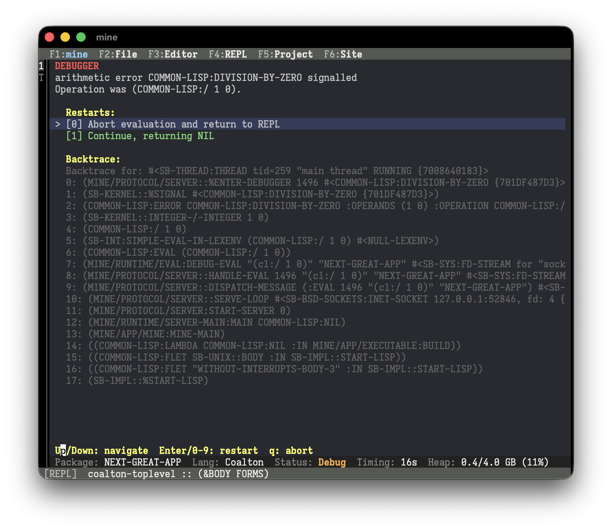
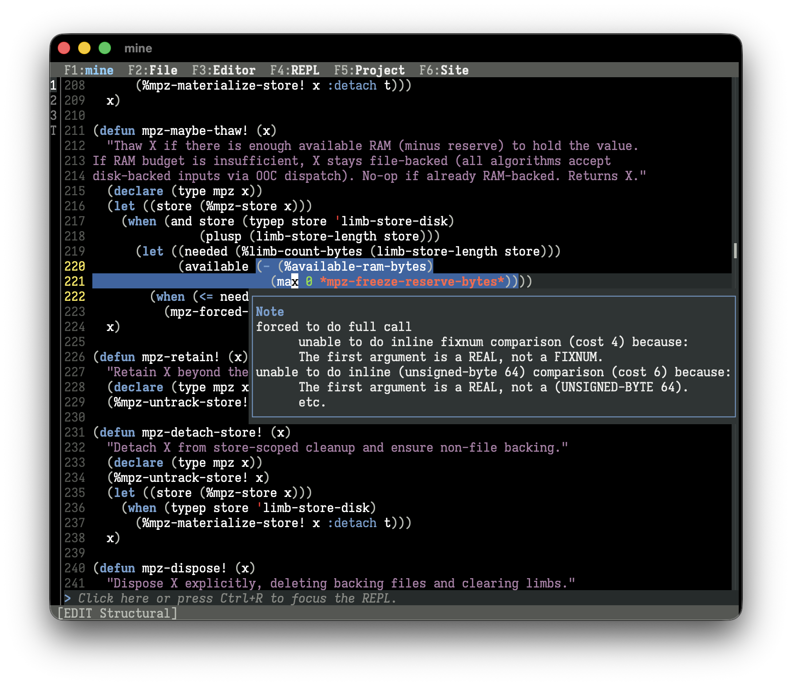
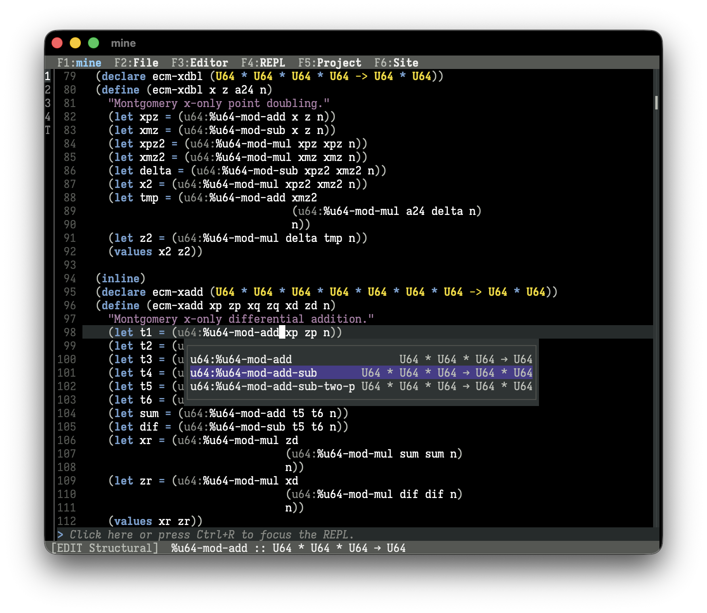
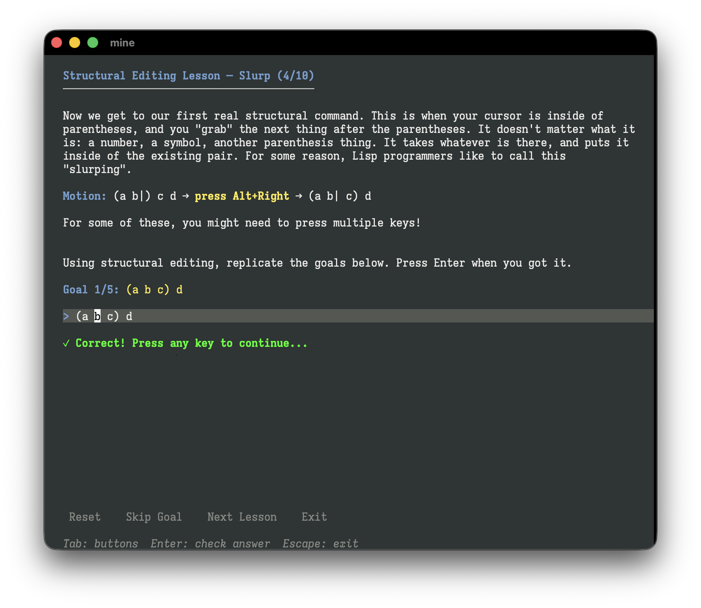
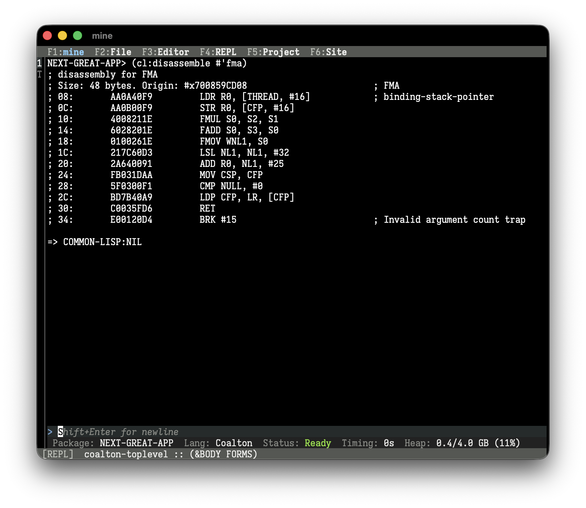

`mine` is an integrated development environment for Coalton and Common Lisp for Windows (x64), macOS (ARM64), and Linux (x64).

👉 <a href="https://github.com/coalton-lang/coalton/releases"><strong>Download the latest release.</strong></a>

`mine` comes in two flavors:

* `mine-app` for Windows and macOS is a complete, all-in-one, packaged application with no dependencies. It Just Works™, or it's a bug.
* `mine-core` for Windows, macOS, and Linux is a hacker-friendly "bring your own compliant terminal" variant. It allows you to use `mine` at the command line, but requires a terminal that has a Unicode font and supports the Kitty keyboard protocol.

### Coalton and Common Lisp

Coalton? Common Lisp? Both? The editor is exclusive to neither, and both come built-in. If you want strong, static types with a flavor of functional programming, Coalton is available. If you want free-wheeling dynamicism and an advanced object system, Common Lisp is available. You can use one, the other, or mix-and-match as your project demands.

### Integrated REPL and Code Beaming

The REPL is completely integrated, not a bolted on afterthought. From functions to entire projects, beam your code to the REPL so you can immediate interact with it.

### Interactive Debugger

When you encounter an error, a debugger will pop up with the error, options to correct it, and a stack trace for your reference.

### Inline Diagnostics

Beaming your code will flag errors and warnings, and they'll show up right in your editor.

In addition, optimization hints will highlight as well, flagging where your code may be sub-optimal in terms of efficiency.

### Type Hints and Auto-Complete

When writing Coalton, the full data type of the function your cursor is on will be shown to you immediately. No guessing what arguments each function takes. If you don't quite know the name of the function, just press tab.

### Structural Editing Lessons

You've heard about structural editing, like ParEdit, but don't want to read manuals and cheat sheets to learn it? Take the built-in structural editing lessons to learn how to do structural editng in about 5 minutes. Structural Editing is completely optional, but vastly increases the efficiency of Coalton development.

### All-Native Code

No virtual machines and no interpreters. All your code is compiled and optimized to the native binary code of your CPU for maximum performance.

