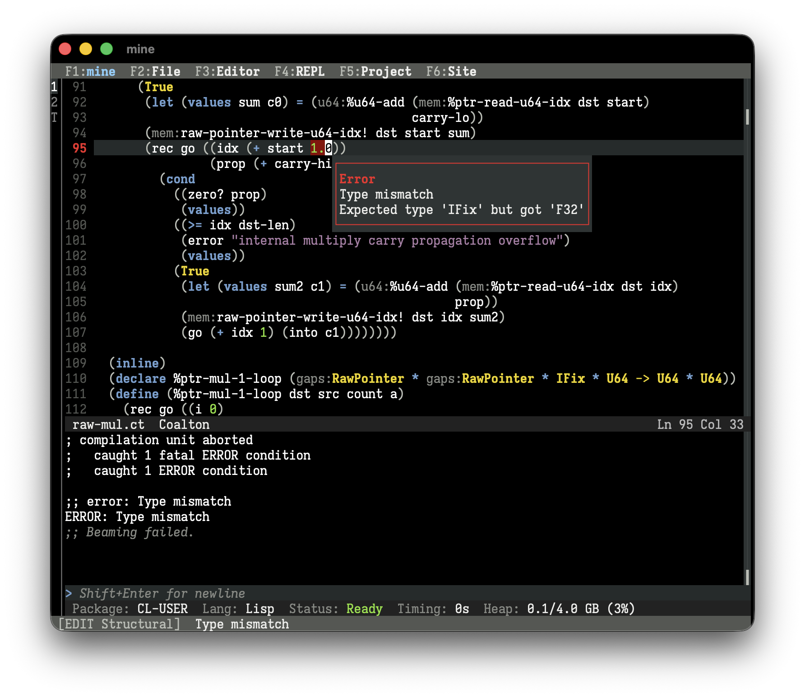

By [Robert Smith](https://twitter.com/stylewarning)

`mine` is a brand new IDE for Coalton and Common Lisp, built from the ground up with one purpose: **To make Coalton and Common Lisp easier and more accessible to the programming world.**

<em>TL;DR? <a href="/mine">Go to mine's homepage with downloads for Windows/macOS/Linux.</a></em>

`mine` is a complete, single-download application that comes with everything needed to experience the interactive and incremental development programming workflow, including hot-reloading and on-the-fly debugging, that Lisp programmers often refer to as *the* differentiating feature of the ecosystem. After installing, one can immediately open a file, program some Coalton or Lisp, and beam code to the REPL. On the same token, it has many of the advanced features you'd expect in a professional IDE:

- Inline diagnostics, from critical errors to harmless optimization notes
- Integrated debugger with readable backtraces
- Jump-to-definition (the Lisper-favorite *meta-dot*)
- Autocomplete that is aware of package nicknames
- Real-time display of argument lists and function types
- Syntax highlighting
- Auto-indentation
- Structural editing
- Project creation and setup
- Built-in Quicklisp setup
- Native code compiler and executable builder

`mine` aims to be pedagogical and discoverable. It should be obvious what is going on at all times, what actions you can do, and what the status is. It even has integrated lessons for structural editing, a unique aspect of programming Lisp enabled by its parenthetical syntax.

`mine` is intentionally conservative. The basic editing features should be familiar to everyone. It uses "normal" keybindings like Ctrl+c and Ctrl+v to copy and paste and it is driven by a keyboard and/or a mouse. `mine` serves new Coalton and Lisp programmers first and foremost, and be a *complete* tool for development in those languages. To that end, 

- `mine` is not a text editor framework, and is not a new text-editing philosophy.
- `mine` is not extensible, has no plugins, and it is barely customizable. There's one look, one layout, and one way to work with it. Customization is limited to genuine needs of accessibility or technical function.
- `mine` has no telemetry, no ads, and no hidden server connections. It doesn't even check for updates on your behalf.
- `mine` is not for other languages.
- `mine` doesn't have emulations of other editors, including vi and Emacs.

`mine` can be used by beginners or experts alike. The IDE can serve as a tool to learn Lisp before jumping into Emacs, or it can be used as a lasting fixture of your Lisp development workflow.

## Why we built `mine`

Common Lisp already has many IDEs. The best free one is Emacs+SLIME, which is used by many Lisp professionals around the world. The best commercial ones are by Franz Inc. and LispWorks, if you don't mind the price tag, which are also used by professionals.

All the bases are covered. Why `mine`?

One of the most common pieces of feedback we get about Coalton is that it's too hard to try out because of all of the steps needed in order to use it:

- To use Coalton, you should know some ASDF or Quicklisp.
- To use ASDF or Quicklisp, you should know some Common Lisp.
- To use Common Lisp, you should know some SLIME.
- To use SLIME, you should know some Emacs.
- To use Emacs, you should be decently familiar with how to download and install FSF software that may be gently antagonistic to your choice of non-free operating system.

Even though there are great, completely free resources to learn Lisp, like *Practical Common Lisp* and *Paradigms in Artificial Intelligence Programming*, interested people are blocked as soon as they need an environment they can work in. The environment, practically speaking, has always been for the learner to figure out.

There is no doubt that Emacs+SLIME is a powerful stack of technology. Emacs itself is an editor largely written in its own dialect of Lisp, and Emacs derivatives have been used as the primary editor for most historical Lisps, including those before Common Lisp even existed. To this day, for certain kinds of people, I will still recommend Emacs as a text editor of superlative flexibility, customizability, and portability.

However, the above is a tall order for someone just wanting to dip their toes in, to see if they have any interest in Coalton or Common Lisp. A couple hours on the weekend is easily sunk into getting configurations right, and the right subsystems installed, and the right paths setup, just so the first line of code can be executed.

`mine` is not Emacs. It aims to eliminate all of that, and be a Coalton/Lisp-first development environment, whose only job is to be a Coalton/Lisp-first development environment. But more than that, it needs to be accessible. A *non-programmer* should find it easy to download, install, and run `mine` with nothing more than a download link.

### What about Lem, Alive, Portacle, etc.?

There have been many other great efforts to make Common Lisp programming easier. From the distinguished CLIMACS to the fresh Lem, all of these editors aim to provide a more modern programming experience. We find that the scope of these projects is generally larger than `mine` aims for. Many of them are intended to be a "next generation Emacs", an editor that is used and useful for anything, of which Lisp programming is merely one sub-feature. Most of these editors follow the editing model of Emacs. They have similar keybindings and workflows, and they largely assume you're coming from an Emacs background.

`mine` is different in that it's supposed to be as easy as the QBASIC or the Borland Turbo products of yore, but for Coalton and Common Lisp. The entire application is built around Coalton and Common Lisp, and is specialized for it. It doesn't assume any particular editing background because it chooses workflows that are of a common denominator. All it assumes is that you have resources at your disposal to learn Coalton or Common Lisp, and nothing more.

## Is `mine` done?

`mine` is being released after months of slow-burn development, followed by a few weeks' worth of sprinting. Before v0.1.0, a generous team of testers worked through about 15 incremental alpha versions to make it usable.

But that's not enough time to make it perfect. Despite the plethora of features, a focus on polish, and weeks of alpha testing, `mine` is still an alpha-quality product. It has papercuts, missing features, pedagogical missteps, and bugs. You should save often, make backups, and [give feedback](https://github.com/coalton-lang/coalton/issues).

We hope to reach v1.0.0 in due time, when the editor can be trusted by professionals for day-to-day Coalton and Common Lisp development, while still being the obvious choice for any Coalton or Common Lisp beginner.

In the mean time, give [mine](/mine) a try. :)

Happy mining!
